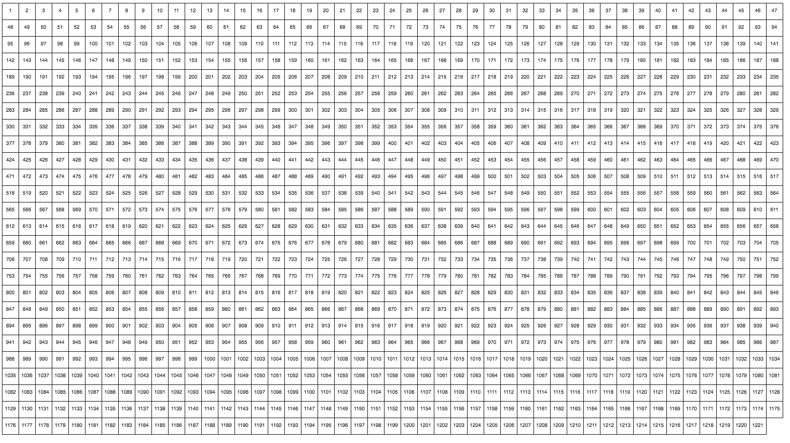
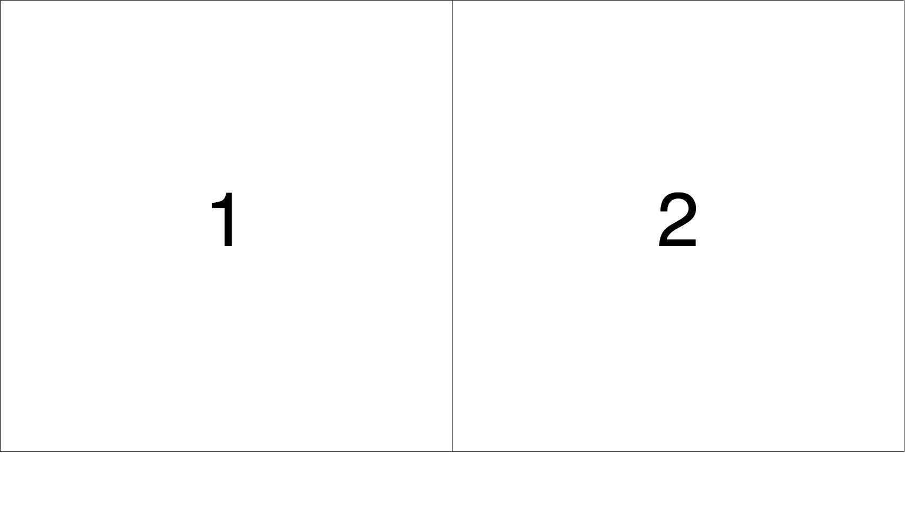
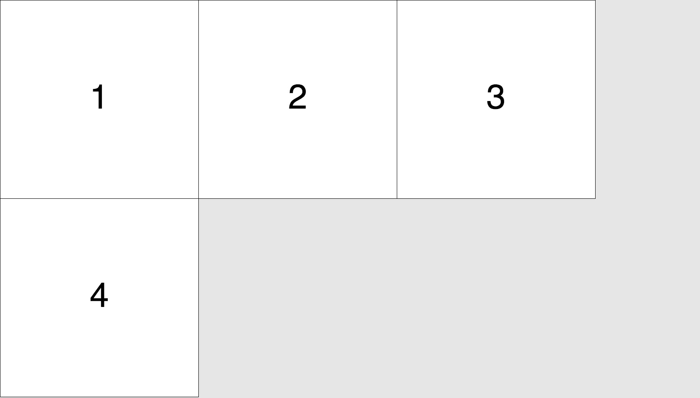
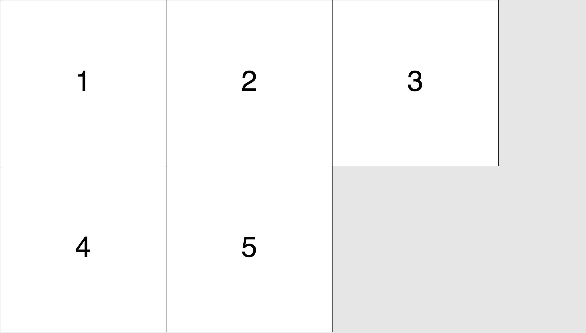

# How to pack a specified number of squares in any given browser window?

## How the program works.  

Each animation frame `calc(n,w,h)` in square_pack.js is
called with three parameters and returns a grid layout.

### params  
(n):(number of squares to pack)
(w):(width of the window)
(h):(height of the window)

### return  
(s):(optimized side of a single square)
(c):(number of columns)
(r):(number of rows)

The returned results are showed as rectangles
with a text, displaying the element number and
rendered in a responsive html5 canvas.

Watch the poor algorithm trying to pack an increasing
number of squares on the screen until it eventually breaks
the loop when (s) is reaching 1.

## Results

I tested this on my laptop screen and had the 
program stop at specific frames to export an image. 

Frame 1

Frame 2

Orientation along the width

Frame 3

Frame 4

Frame 5

## Working example:  

https://matthias-jaeger-net.github.io/square_pack.js/

## About square_pack in python
This JavaScript code is based on square_pack by Markus Murschitz,
who wrote the code for calc() in python, after talking to me about
the problem on a lazy afternoon in Austria.

Have a look at his version: https://github.com/mamut-m/square-pack

## libs   
I'm also using the P5 JavaScript library to render this
animation in the browser window.

http://p5.js.org
