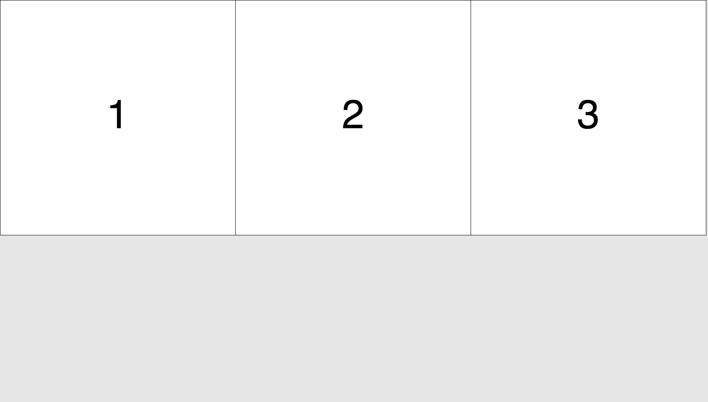

# How to pack a specified number of squares in a given browser window, maintaining an optimal side length?


Watch our poor algorithm trying to pack an increasing
number of squares on the screen until it eventually breaks
the loop when (s) is reaching 1.

https://matthias-jaeger-net.github.io/square_pack.js/

## About the problem  
Imagine you would want to place N squares in a given area,
defined by its width and height. Our algorithm is based on code
by Markus Murschitz, who wrote a python version of this, that
I translated poorly into JavaScript.

Have a look at Markus version: https://github.com/mamut-m/square-pack

## About my program  

I'm using the P5 JavaScript library (http://p5.js.org) to setup and draw
an animation in a responsive HTML5 canvas element. Each frame i call
our algorithm with a constantly increasing specified number and the current
size of the window and draw the results to the screen.


```JavaScript
// calculate biggest possible length
const len_opt = floor(sqrt(w * h / n));
```


```JavaScript
// calculate biggest possible length
const len_opt = floor(sqrt(w * h / n));
```

```JavaScript
// calculate biggest possible length
const len_opt = floor(sqrt(w * h / n));
```

```python
    a_opt = int(floor(sqrt(float(w*h)/ns)))

    for a in range(a_opt,0,-1):
        nx = int(floor(w/a))
        ny = int(floor(h/a))
        if nx > 0 and ny > 0 and nx * ny >= ns:
            break   
```


## How the example works.  

I setup and draw an animation with the p5 JavaScript library.
Each animation frame `calc(n,w,h)` in square_pack.js is
called with three parameters and returns a grid layout.

### params  
(n):(number of squares to pack)
(w):(width of the window)
(h):(height of the window)

### return  
(s):(optimized side of a single square)
(c):(number of columns)
(r):(number of rows)

The results are rendered as a grid of
labled squares in a responsive html5 canvas.


# Results

Testing the





## About square_pack in python


## libs   
I'm also using the P5 JavaScript library to render this
animation in the browser window.

http://p5.js.org
