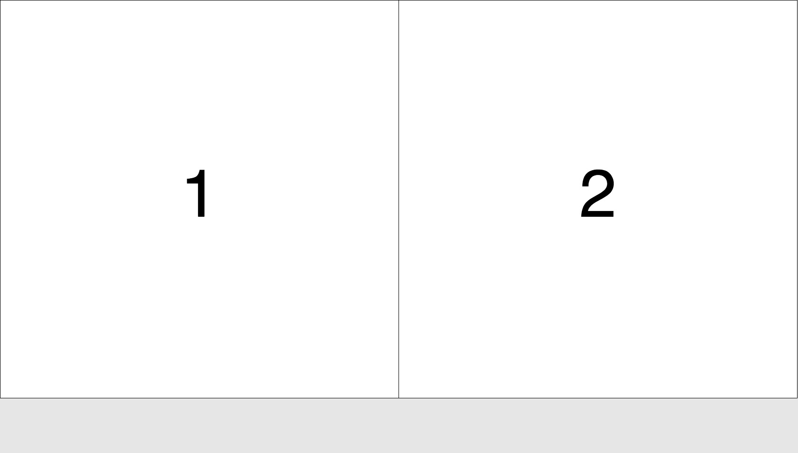

# How to pack a specified number of squares in any given browser window?


## This problem was bothering me for a long time   

This JavaScript code is based on square_pack by Markus Murschitz,
who wrote the code for calc() in python, after talking to me about
the problem on a lazy afternoon in Austria. See my translation below.
Have a look at his version: https://github.com/mamut-m/square-pack

```JavaScript
let a_opt = round(sqrt(w * h / ns));
let a = a_opt, nx, ny;
while (a > 0) {
  nx = floor(w / a);
  ny = floor(h / a);
  a--;
  if(nx > 0 && ny > 0 && nx * ny >= ns) {
    break;
  }
}
```

```python
def calc(ns,w,h):
    """ calculate the size of squares and the grid (nx times ny cells) they can be placed in to optimaly fill a rectangle
    @param ns: number of squares
    @param w: width of the available space in pixels
    @param h: height of the available space in pixels
    @return: (square length(=height) in pixels, number of columns, and number of rows)
    Example:
    >>> calc(6, 640 ,480)
    (213, 3, 2)
     """
    if ( ns > w * h ):
        raise ValueError("can not fit " + str(ns) + " squares (of a at least 1x1 px) in an image of size " + str(w) + " x " + str(h))
    if ( ns == 0 ):
        raise ValueError("can not fit 0 squares")
    a_opt = int(floor(sqrt(float(w*h)/ns)))

    for a in range(a_opt,0,-1):
        nx = int(floor(w/a)) 
        ny = int(floor(h/a))
        if nx > 0 and ny > 0 and nx * ny >= ns: 
            break   
return a, nx, ny 
```

## How the example works.  

I setup and draw an animation with the p5 JavaScript library.
Each animation frame `calc(n,w,h)` in square_pack.js is
called with three parameters and returns a grid layout.

### params  
(n):(number of squares to pack)
(w):(width of the window)
(h):(height of the window)

### return  
(s):(optimized side of a single square)
(c):(number of columns)
(r):(number of rows)

The results are rendered as a grid of
labled squares in a responsive html5 canvas.

## Working example:  

Watch the poor algorithm trying to pack an increasing
number of squares on the screen until it eventually breaks
the loop when (s) is reaching 1.

https://matthias-jaeger-net.github.io/square_pack.js/

# Results

## n = 1


In this case the biggest square is built from the shorter side.


## n = 2


Jumping to the longer side and building two squares in a row.

## n = 3


Three squares? Best fits with three in a row in this case.

## n = 4


## About square_pack in python


## libs   
I'm also using the P5 JavaScript library to render this
animation in the browser window.

http://p5.js.org
